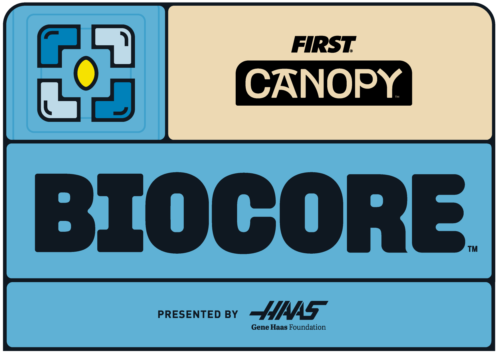

<div align="center">




# Biocore2026‑SimV2

<sub>Building season codebase — FRC Team 7563 Megazord — 2026/2027 Biocore season</sub>

<br />

<a href="https://docs.wpilib.org"></a>
<a href="https://www.oracle.com/java/"></a>
<a href="https://gradle.org"></a>
<a href="https://github.com/MegaZord7563/Biocore2026-SimV2/actions/workflows/build.yml"></a>


<br /><br />

<a href="#-overview">Overview</a> ·
<a href="#-features">Features</a> ·
<a href="#-subsystems">Subsystems</a> ·
<a href="#️-getting-started">Getting Started</a> ·
<a href="#-repository-structure">Repository Structure</a> ·
<a href="./CONTRIBUTING.md">Contributing</a>

</div>

<br />

## 📡 Overview

<table>
<tr>
<td>

**Biocore2026‑SimV2** is Team 7563's simulation‑first sandbox for the 2026/2027 *Biocore* season robot code. It carries the swerve drivetrain, logging pipeline and vendor stack that the season's control system is built on, wired up for desktop simulation (`SwerveModuleIOSim` / `GyroIOSim`) so the drive base, PID gains and command bindings can be validated before anything touches the roboRIO.

The rest of the season's mechanisms (intake, shooter/turret, feeder, indexer) already have their constants and gains staged in `Constants.java`, ready to be wired into subsystems as they come online during build season.

</td>
</tr>
</table>

<br />

## ✨ Features

<table>
<tr>
<td width="33%" valign="top" align="center">
<h3>🕹️</h3>
<b>Swerve Drive (Sim)</b>
<br />
<sub>4‑module holonomic drivetrain with field‑oriented control, running on <code>SwerveModuleIOSim</code> for desktop simulation</sub>
</td>
<td width="33%" valign="top" align="center">
<h3>📈</h3>
<b>AdvantageKit Logging</b>
<br />
<sub>Full IO‑layer logging with WPILOG output, NT4 live streaming, and replay support via <code>Robot.java</code></sub>
</td>
<td width="33%" valign="top" align="center">
<h3>🔌</h3>
<b>URCL + REV/CTRE Stack</b>
<br />
<sub>Unofficial REV Logging Compatibility Layer plus native Phoenix 6 (Kraken) and REVLib (Spark) integration</sub>
</td>
</tr>
<tr>
<td width="33%" valign="top" align="center">
<h3>🧭</h3>
<b>PathPlannerLib</b>
<br />
<sub>Holonomic auto config pre‑wired from drivetrain mass, MOI and module characterization in <code>Constants</code></sub>
</td>
<td width="33%" valign="top" align="center">
<h3>⚡</h3>
<b>Current Limiting</b>
<br />
<sub>Supply/stator current limits configured per motor group, following CTRE's performance guidance</sub>
</td>
<td width="33%" valign="top" align="center">
<h3>🎮</h3>
<b>Drive Modes</b>
<br />
<sub><code>SLOW</code> / <code>FAST</code> / <code>MAX</code> speed profiles bound to bumpers on the driver <code>CommandXboxController</code></sub>
</td>
</tr>
</table>

<br />

## 🧩 Subsystems

<table>
<tr><th align="left">Subsystem</th><th align="left">Package</th><th align="left">Status</th></tr>
<tr>
<td>Swerve Drive</td>
<td><code>subsystems/swerve</code></td>
<td>✅ Implemented — <code>SwerveSubsystem</code>, <code>SwerveModule</code>, <code>Gyro</code>, sim IO layers</td>
</tr>
<tr>
<td>Intake / Articulator</td>
<td><code>Constants.SubsystemsConstants.IntakeConstants</code></td>
<td>🟡 Gains staged, subsystem pending</td>
</tr>
<tr>
<td>Shooter (Turret, Flywheel, Capo)</td>
<td><code>Constants.SubsystemsConstants.shooterConstants</code></td>
<td>🟡 Gains + interpolation maps staged, subsystem pending</td>
</tr>
<tr>
<td>Feeder</td>
<td><code>Constants.SubsystemsConstants.FeederConstants</code></td>
<td>🟡 Gains staged, subsystem pending</td>
</tr>
<tr>
<td>Indexer</td>
<td><code>Constants.SubsystemsConstants.IndexerConstants</code></td>
<td>🟡 Gains staged, subsystem pending</td>
</tr>
</table>

<br />

## 🛠️ Getting Started

<table>
<tr><td width="28"><b>1</b></td><td>

```bash
git clone https://github.com/MegaZord7563/Biocore2026-SimV2.git
cd Biocore2026-SimV2
```

</td></tr>
<tr><td><b>2</b></td><td>

Install **WPILib 2026** (VS Code, Java extensions, Shuffleboard, roboRIO/Game Tools) from the [official WPILib installer](https://docs.wpilib.org/en/stable/docs/zero-to-robot/step-2/wpilib-setup.html).

</td></tr>
<tr><td><b>3</b></td><td>

```bash
./gradlew build
```

</td></tr>
<tr><td><b>4</b></td><td>

Run the desktop simulator (opens Sim GUI + Driver Station):

```bash
./gradlew simulateJava
```

</td></tr>
<tr><td><b>5</b></td><td>

Deploy to the roboRIO (team **7563**) over USB or the field network:

```bash
./gradlew deploy
```

</td></tr>
</table>

<br />

## 📁 Repository Structure

```
Biocore2026-SimV2/
├── src/main/java/br/megazord/frc7563/
│   ├── Main.java              # Entry point — do not modify
│   ├── Robot.java             # Lifecycle + AdvantageKit/URCL logging setup
│   ├── RobotContainer.java    # Subsystems, OI bindings, autonomous
│   ├── Constants.java         # All robot-wide constants and gains
│   └── subsystems/swerve/     # Drivetrain: modules, gyro, IO + sim layers
├── src/main/deploy/           # Files deployed to the roboRIO
├── vendordeps/                # AdvantageKit, PathPlanner, Phoenix6, REVLib, URCL
├── .github/workflows/         # CI — Gradle build on every push/PR
└── build.gradle                # GradleRIO build configuration
```

<br />

<div align="center">


<sub>Built by <a href="https://github.com/MegaZord7563">Team 7563 — Megazord</a> · Jundiaí, SP, Brazil</sub>

<br />

<sub>See <a href="./CONTRIBUTING.md">CONTRIBUTING.md</a> for branching strategy, PR workflow and code review standards.</sub>

</div>
